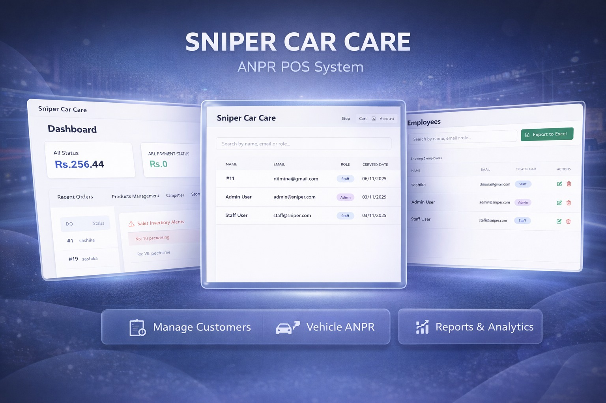

# Sniper Car Care POS & ANPR Platform

A complete digital platform for a Dubai-based car service business. It helps manage vehicle intake, services, customer engagement, POS billing, online payments, loyalty rewards, and reporting in one system.


## Overview

Sniper Car Care POS & ANPR Platform is a full-stack business system for a modern car care center. It connects staff operations with customer-facing digital flows to make the whole service process faster and easier.

## Highlights

- Vehicle recognition based intake flow
- Staff and admin dashboard for daily work
- Customer and vehicle registration with plate tracking
- Product and stock management
- POS order handling and payment processing
- Public customer ordering flow
- Loyalty tracking and free service redemption
- Feedback collection workflow
- Analytics, exports, and reporting

## Screenshot



## Technology Stack

| Layer | Stack |
|---|---|
| Frontend | React 18, Vite, Tailwind CSS |
| Backend | Node.js, Express, MySQL, JWT, Axios |
| Database | MySQL |
| Payments | Stripe |
| Messaging | Reson8 |
| Reporting | XLSX, CSV, PDFKit |
| Security | JWT authentication |

### Database Layer

The database layer has these main entities:

- Users
- Customers
- Vehicles
- Products
- Suppliers
- Orders
- Order items
- Payments
- Services
- Loyalty
- Feedback
- Reports

## Business Workflow

### Vehicle Arrival and Identification

1. A vehicle arrives at the service center.
2. The ANPR flow detects or identifies the number plate.
3. The system checks if the vehicle already exists in the customer database.
4. If found, the customer record is reused and updated.
5. A personal customer link can be created and sent automatically.

### Service and POS Operations

1. Staff register customers, services, and orders from the dashboard.
2. Products are added to orders and stock is updated.
3. Payments are recorded as digital or manual payments.
4. Orders and services stay visible to staff in real time.
5. Managers can monitor business activity through reports and dashboards.

### Customer Journey

1. The customer receives a vehicle-specific or service-specific link.
2. The customer opens the public website.
3. The customer views products or service options.
4. The customer places an order and completes payment.
5. The order data is synced with the main system.

### Retention and Follow-Up

1. Completed services give loyalty points.
2. Customers can become eligible for a free service.
3. Feedback requests can be sent after service completion.
4. Staff and management can review customer feedback and service patterns.

## Project Structure

```text
.
|-- backend/
|-- frontend/
|-- customer-website/
|-- customer-website-saloon/
|-- customer-website-4x4/
|-- database/
|-- Doc/
`-- README.md
```

## Local Setup

### Prerequisites

- Node.js 18+
- npm
- MySQL 8+

### Backend

```powershell
cd backend
npm install
npm run dev
```

### Customer Websites

Run each app separately:

```powershell
cd customer-website
npm install
npm run dev
```

```powershell
cd customer-website-saloon
npm install
npm run dev
```

```powershell
cd customer-website-4x4
npm install
npm run dev
```

## Default Local Users

- `admin@sniper.com` / `admin123`
- `staff@sniper.com` / `staff123`

These credentials are only for local development.
